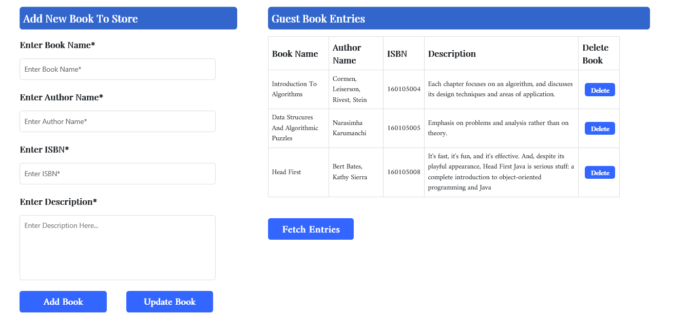

# GuestBookStore

### Built With: 

- Servlet(Java EE Driven Server)

- JSP

### Get started with these steps :

1. Clone the repo on your local machine.Visit [Github Guides](https://help.github.com/articles/cloning-a-repository/) to know how to clone the repository.

2. Navigate to  GuestBookStore/src/java/dit/Welcome.java

### Screenshot:

## Feel Free To Add Book To Store
